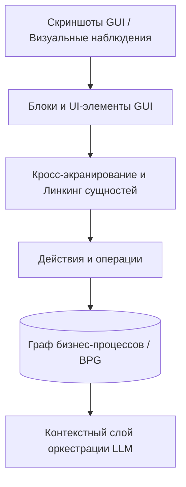

# Архитектура системы

## Верхнеуровневый пайплайн (High-level Pipeline)

## Соответствие архитектурных диаграмм (Diagram Mapping)

Материалы и графические схемы расположены в директории `diagrams/bpg_rkb/`:

* `gui_to_blocks.png` → Модуль детекции интерфейса (`gui_detection/`)
* `entity_linking.png` → Модуль линкинга и связывания сущностей (`linking/`)
