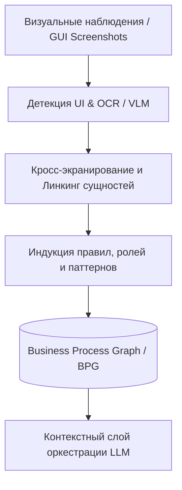

# Граф бизнес-процессов на основе GUI для доменно-ориентированных LLM-агентов

## Обзор (Overview)

В данном репозитории представлен исследовательский прототип, разработанный в рамках магистерской диссертации.

Ключевая цель проекта — сделать автономных LLM-агентов **доменно-ориентированными (domain-aware)** за счёт построения явного графа бизнес-логики, извлекаемого **исключительно из визуальных наблюдений интерфейса (GUI)**.

Система работает в условиях полного «чёрного ящика» (Black-Box Environment):
* ❌ Без доступа к бэкенду и внутренним API.
* ❌ Без прямого доступа к исходному коду и структурам БД.
* ❌ Без формальной сопроводительной документации.

Только:
* ✔ Скриншоты и визуальные элементы GUI.
* ✔ Распознавание текста и визуальных структур (OCR / VLM).
* ✔ Наблюдаемые состояния и переходы интерфейса.

---

## Проблематика (Motivation)

Современные мультимодальные LLM-агенты успешно распознают элементы UI и умеют взаимодействовать с кнопками, но **не имеют фундаментального понимания предметной области и бизнес-ограничений системы**.

Это приводит к системным проблемам:
1. **Семантическая невалидность:** Агент совершает синтаксически корректные действия (кликнул на доступную кнопку), которые нарушают бизнес-логику процесса (например, проводит документ без заполнения обязательных полей).
2. **Хрупкость традиционного RPA:** Сценарии ломаются при малейшем изменении UI, так как жёстко привязаны к координатам или селекторам.
3. **Отсутствие объяснимости (Explainability):** При сбоях невозможно восстановить причинно-следственную связь и корректно обработать исключение (Edge Case).

**Решение:** Введение **Графа бизнес-процессов (Business Process Graph, BPG)** в качестве динамической базы знаний (Runtime Knowledge Base) для планирования и оркестрации агентов.

---

## Практическая ценность и Бизнес-эффект (Value Proposition)

> **Явные знания о предметной области + адаптивное планирование LLM = устойчивая и объяснимая автоматизация**

Внедрение BPG позволяет решить задачи автоматизации для легаси-систем (Enterprise Legacy Systems), где API отсутствуют или недоступны:
* **Снижение TTM (Time-to-Market):** Быстрое развёртывание AI-агентов поверх существующих интерфейсов без дорогостоящей интеграции с бэкендом.
* **Детерминированность действий:** Граф задаёт жёсткие рамки пред- и пост-условий (Guards & Rules), предотвращая галлюцинации и некорректные транзакции LLM.
* **Прозрачность и аудит:** Каждое решение агента прослеживается по узлам и связям графа (Data Provenance).

---

## Архитектура системы (Core System Architecture)

### Границы доступа (System Scope)

* **Что система использует:** Скриншоты GUI, распознанный текст (OCR), пространственные координаты элементов, наблюдаемые визуальные состояния и экраны.
* **Что изолировано:** Внутренний DOM/HTML, исходный код, API-эндпоинты, прямые SQL-запросы к БД.

---

## Структура Графа Бизнес-Процессов (BPG Schema)

BPG представляет собой направленный мультиграф, связывающий концептуальные сущности бизнеса с их визуальным проявлением в интерфейсе:

### Основные типы узлов (Nodes):

* **EntityType:** Абстрактные бизнес-сущности (например, *Заказ*, *Клиент*, *Счёт*).
* **EntityInstance:** Конкретный экземпляр сущности в текущем контексте.
* **GUIManifestation:** Элементы интерфейса, через которые сущность проявляется (форма, таблица, модальное окно).
* **Action:** Допустимые атомарные операции (*Создать*, *Утвердить*, *Отправить*).
* **PatternNode:** Повторяющиеся последовательности и сценарии.
* **Rule:** Бизнес-ограничения, валидации и пред-условия.

### Типы связей (Edges):

* `cross_view` — связь элементов между разными экранами/модулями.
* `functional` — функциональная зависимость действий.
* `temporal` — хронологическая последовательность шагов.
* `conditional` — логические условия выполнения (If-Then).
* `compositional` — иерархическая структура (Parent-Child).
* `role` — контекст ролевой модели (RBAC / разрешения).

*Подробная формальная схема описана в файле `BPG_SCHEMA.md`.*

---

## Инженерные принципы (Design Principles)

* **GUI-only Evidence:** Все гипотезы о бизнес-логике строятся исключительно на наблюдаемом визуальном поведении UI.
* **Явная оценка неопределённости (Confidence Scores):** Каждый узел и связь графа имеют веса достоверности.
* **Прослеживаемость (Provenance):** Любой вывод можно отследить до конкретного визуального элемента или интерфейсного состояния.
* **Модульность:** Выделенный слой графа абстрагирован от конкретного LLM-провайдера или OCR-движка.
* **Объяснимость в приоритете:** Архитектура ориентирована на интерпретируемость графа, а не на «слепое» исполнение промптов.

---

## Навигация по документации

* `PROJECT_CONTEXT.md` — концептуальная постановка задачи и научный контекст.
* `ARCHITECTURE.md` — детальное описание модулей системы и пайплайнов обработки данных.
* `BPG_SCHEMA.md` — формальная спецификация графовой схемы и типов связей.
* `TECH_STACK.md` — стек технологий, используемые библиотеки и фреймворки.
* `diagrams/bpg_rkb/` — архитектурная документация и диаграммы графа.

---

## Статус проекта

Проект находится в стадии **исследовательского PoC (Proof of Concept)**. Основной акцент сделан на чистоту архитектурных абстракций, строгость графовой схемы и возможность проведения воспроизводимых экспериментов.
