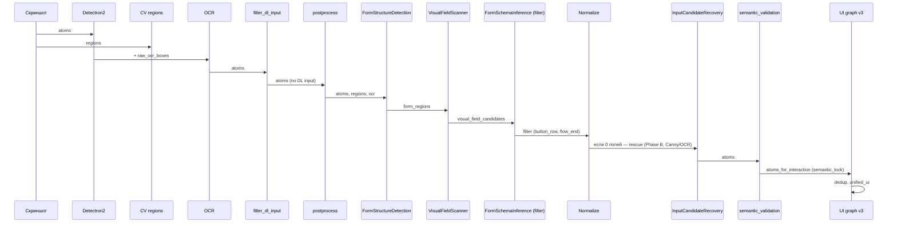

# Архитектура пайплайна atoms_v2

**Документ обновляется при изменении пайплайна.** Актуальный код: `src/infrastructure/atoms_v2/pipeline.py`.

---

## 1. Общая идея

- **ML — только атомы:** Detectron2 даёт button, link, layout и т.д.; **input от DL не используется** (фантомы).
- **CV — регионы:** карточки, секции (визуальные контейнеры).
- **Input/textarea** восстанавливаются по **структуре формы** (layout), а не по контурам/Canny.
- **OCR** — полностраничный или по регионам; связь текст ↔ атомы и регионы.

---

## 2. Схема пайплайна

```mermaid
flowchart TB
    subgraph INPUT["Скриншот"]
        IMG[Скриншот]
    end

    subgraph DL["Детекция (DL)"]
        DET[Detectron2: atoms (no input)]
        REG[CV: регионы (form_card, navbar, header, footer)]
    end

    subgraph OCR_BLOCK["OCR и связь"]
        OCR[Full-page / per-region OCR]
        LINK[_link_ocr_to_atoms]
    end

    subgraph CLEAN["Очистка DL и postprocess"]
        FILTER[filter_dl_input_atoms]
        POST[run_postprocess: filter link, synthetic buttons]
    end

    subgraph MULTILEVEL["Многоуровневое ориентирование"]
        MACRO[MacroLocator: крупные блоки]
        MESO[MesoLayoutInference: schema & row_bands]
        MICRO[MicroFieldScanner: visual_candidates → bbox по полосам]
        VALID[SchemaValidator: schema vs detected_fields]
    end

    subgraph FALLBACKS["Fallback пути"]
        VISUAL[VisualFirstFieldInference]
        CARD_LAYOUT[CardFieldLayoutInference]
        RECOVERY[InputCandidateRecovery]
    end

    subgraph SEM["Семантика и граф"]
        PROBE[input_probe_prepass_v3]
        PRIORS[CatBoost priors + group_atoms]
        SEMVAL[run_semantic_validation]
        REFINE[input_bbox_refinement]
        PREPASS[input_bbox_prepass]
        UIGRAPH[run_ui_graph_pipeline_v3]
        DEDUP[dedup image_id, atom_id]
    end

    subgraph OUT["Выход"]
        ATOMS[atoms]
        UNIFIED[unified_ui]
    end

    IMG --> DET
    IMG --> REG
    DET --> OCR
    REG --> OCR
    OCR --> LINK
    LINK --> FILTER
    FILTER --> POST
    POST --> MACRO
    MACRO --> MESO
    MESO --> MICRO
    MICRO --> VALID
    VALID -->|ok| SEM
    VALID -->|0 fields| VISUAL
    VISUAL -->|0 fields| CARD_LAYOUT
    CARD_LAYOUT -->|0 fields| RECOVERY
    RECOVERY --> SEM
    SEM --> PROBE
    PROBE --> PRIORS
    PRIORS --> SEMVAL
    SEMVAL --> REFINE
    REFINE --> PREPASS
    PREPASS --> UIGRAPH
    UIGRAPH --> DEDUP
    DEDUP --> ATOMS
    ATOMS --> UNIFIED
```

**Инварианты многоуровневого пути (геометрия из изображения):**
- **Источник истины — CV/OCR.** Схема — фильтр и ограничитель, не источник bbox.
- Полосы строк (row_bands): якоря по Y (визуальные кандидаты + OCR baseline) → кластеризация; фиксированные ratio только fallback.
- Колонки grid: кластеризация x_center визуальных кандидатов → границы колонок; schema.columns только fallback.
- 1 слот → не более 1 bbox; выбор кандидата по многокритериальному скору (aspect, текст внутри, выравнивание), не по площади. Пустой слот допустим.
- flow_end_row_index строго; Mixed обрабатывается по строкам (field_row / button_row), не пропускается.
- SchemaValidator: обрезка до slot_count, отбрасывание полей вне field_row полос, понижение confidence при несовпадении.

**Упрощённая последовательность (ключевые блоки):**



---

## 3. Порядок шагов (детально)

| # | Шаг | Описание |
|---|-----|----------|
| 1 | **Детекция атомов** | Single: `_run_detectron2_atoms`. Dual: `_run_dual_detectron2_atoms` → merge + stabilize. Input от DL не добавляется; позже — `filter_dl_input_atoms`. |
| 2 | **CV-регионы** | `_run_cv_visual_regions`, `_assign_atoms_to_regions`. |
| 3 | **OCR** | Full-page или per-region; при dual — `filter_synthetic_atoms_by_ocr`, merge, `_filter_buttons_by_dominant_color`. `_link_ocr_to_atoms`, `_assign_full_page_ocr_to_regions`. |
| 4 | **Подавление DL input** | `filter_dl_input_atoms(atoms)` — удаление `source==detectron2` и `type in DL_INPUT_BLACKLIST`. Лог: `dl_input_suppressed: N`. |
| 5 | **Postprocess** | `run_postprocess`: фильтр link, synthetic button/input из OCR. |
| 6 | **Тема и форма** | `dark_theme` по luminance; `detect_form_regions(regions, atoms, raw_ocr_boxes)`. |
| 7 | **Многоуровневое ориентирование (primary)** | При `form_regions`: **MacroLocator**; для каждой карточки **Meso** (только схема); **VisualFieldScanner**; **GeometryAnchors** (row_bands из Y-якорей визуальных/OCR, колонки из кластеризации x_center); **MicroFieldScanner** (выбор по многокритериальному скору, пустой слот допустим); **SchemaValidator** (обрезка, поля вне полос отбрасываются, понижение confidence). Mixed обрабатывается по строкам. Fallback: visual_first → card_field_layout → InputCandidateRecovery. |
| 8 | **InputCandidateRecovery** | Только если `not form_regions` или 0 полей от multilevel/visual_first/card_layout. OCR seeds + VisualFieldScanner seeds, Phase B (Canny), veto, propagation, dedup. |
| 9 | **input_probe_prepass_v3** | Probe OCR для кандидатов input (probe_ocr_text/len). |
| 10 | **CatBoost + group_atoms** | `build_ui_graph` → `extract_features` → `run_catboost_priors` → `group_atoms`. Атомы не удаляются. |
| 11 | **semantic_validation** | Назначение semantic_role и semantic_lock; input vs button scoring; prune to layout. |
| 12 | **input_bbox_refinement** | `refine_input_bbox_like_button`: отсечение label, snap к границам, нормализация ширины. |
| 13 | **input_bbox_prepass** | Расширение bbox по OCR для input/weak_input (interactive_valid). |
| 14 | **UI graph v3** | `run_ui_graph_pipeline_v3` по atoms с semantic_lock; dedup (image_id, atom_id); при необходимости dataset_builder. |
| 15 | **Выход** | atoms_for_ui, atom_to_region, text_ui_links, unified_ui, debug_image. |

---

## 4. Ключевые инварианты

| Правило | Где обеспечивается |
|--------|---------------------|
| Input от DL не участвует в UI | Не добавляем в детекторе; `filter_dl_input_atoms` до postprocess. |
| Источник bbox — физические границы | VisualFieldScanner внутри card (контуры, границы). Schema только фильтрует; не создаёт bbox. |
| Input/textarea — из визуальных кандидатов | Visual First → filter by schema → normalize. Recovery (Phase B, Canny) только при 0 полей. |
| Роли и «замок» только в семантике | semantic_validation назначает semantic_role и semantic_lock. |
| В UI-графе только «замок» | atoms_for_interaction = атомы с semantic_lock. |

---

## 5. Модули (файлы)

| Модуль | Файл |
|--------|------|
| Пайплайн | `src/infrastructure/atoms_v2/pipeline.py` |
| Формы | `form_structure_detection.py` |
| Макроуровень (крупные блоки) | `macro_locator.py` |
| Мезоуровень (строки/слоты, схема) | `meso_layout_inference.py` |
| Геометрия из изображения (полосы, колонки) | `geometry_anchors.py` |
| Микроуровень (bbox в строке, скоринг) | `micro_field_scanner.py` |
| Валидация и приведение схема ↔ поля | `schema_validator.py` |
| Оркестрация многоуровневого пути | `multilevel_field_inference.py` |
| Визуальные кандидаты внутри card | `visual_field_scanner.py` |
| Visual First (fallback) | `visual_first_field_inference.py` |
| Схема формы (только фильтр) | `form_schema_models.py`, `form_schema_inference.py` |
| Поля по контурам (fallback) | `input_candidate_recovery.py` |
| Семантика | `semantic_validation.py` |
| Уточнение bbox input | `input_bbox_refinement.py` |
| Postprocess | `postprocess.py` |
| Merge (dual) | `merge_stabilize.py` |

---

### 5.1. Form Container First (ТЗ, side-path)

**Инвариант №0:** ни строка, ни слот, ни поле не существуют вне FormContainer.bbox. Подключается флагом `use_form_container_first=True` в `run_atoms_v2_pipeline`. Вызывается после baseline multilevel.

**Полный пошаговый алгоритм пайплайна форм:** см. **`docs/FORM_CONTAINER_FIRST_PIPELINE.md`** (построение строк из CV-якорей, OCR только для label/helper/ACTION, grid, textarea, слоты, граф). При изменении кода в `experimental_v2/` обновлять тот документ.

| Уровень | Модуль | Файл |
|---------|--------|------|
| 0 | FormContainerDetector | `experimental_v2/form_container_detector.py` |
| 1 | FormInnerLayout (RowDetector, ColumnDetector) | `experimental_v2/form_inner_layout.py` |
| 2 | SlotDetector | `experimental_v2/slot_layout_inference.py` |
| 3 | FieldLocator (role-based, внутри контейнера) | `experimental_v2/role_based_field_locator.py` |
| 4 | FormGraphAssembler | `experimental_v2/form_graph_assembler.py` |
| — | Точка входа | `experimental_v2/run_form_container_first_inference.py` |

**Правила:** форма — геометрический контейнер (замкнутый прямоугольник, светлый фон, border), не «остаток между header и footer»; границы строк — из CV (visual_candidates + якоря), OCR не задаёт row_y_min/max; label/helper/ACTION — по OCR с валидацией текста. Debug: container_bbox.png, rows.png, rows_with_types.png, skipped_rows.png, textarea_rows.png, rows_debug.png, slots.png, slot_assignments.png, form_graph.png.

### 5.2. Experimental multilevel v2 (side-path)

Альтернативный путь «от вершины к листьям» (без обязательного FormContainer): `use_experimental_multilevel_v2=True`. Baseline не изменяется.

| Уровень | Модуль | Файл |
|---------|--------|------|
| 0 | PageOrientationContext | `experimental_v2/page_orientation_context.py` |
| 1 | SemanticRegionBuilder | `experimental_v2/semantic_region_builder.py` |
| 2 | FormSkeletonBuilder | `experimental_v2/form_skeleton_builder.py` |
| 3 | SlotLayoutInference | `experimental_v2/slot_layout_inference.py` |
| 4 | RoleBasedFieldLocator | `experimental_v2/role_based_field_locator.py` |
| 5 | FormGraphAssembler | `experimental_v2/form_graph_assembler.py` |
| — | Точка входа | `experimental_v2/run_experimental_v2.py` |

При `experimental_v2_debug_dir`: level0_page_orientation.png … level5_form_graph.png.

---

## 6. Схема (PlantUML)

Полная схема: **`diagrams/atoms_v2/pipeline_atoms_v2.puml`**. Рендер: PlantUML или плагин в IDE.

---

## 7. Как обновлять

При изменении пайплайна (`pipeline.py` или связанных модулей):

1. **Обновить этот документ** — секции 2–5 (схема Mermaid, порядок шагов, инварианты, модули).
2. **Обновить PlantUML** — `diagrams/atoms_v2/pipeline_atoms_v2.puml` (блоки и связи).
3. Проверить, что нумерация шагов в таблице совпадает с порядком вызовов в коде.

При изменении **Form Container First** (`experimental_v2/`: form_inner_layout, slot_layout_inference, run_form_container_first_inference и др.):

4. **Обновить описание алгоритма форм** — `docs/FORM_CONTAINER_FIRST_PIPELINE.md` (шаги построения строк, слотов, роли OCR/CV, ветки слотов).
5. При необходимости скорректировать секцию 5.1 выше (модули, правила, debug-файлы).
